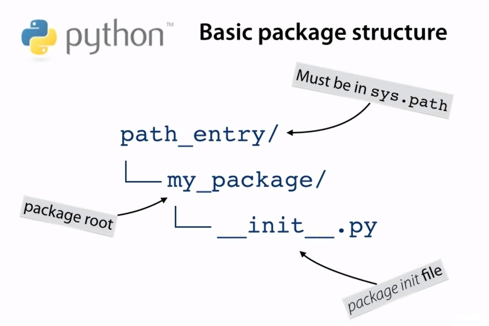

Packages
--------
- Packages are directories 
- Modules are files
- Difference while using both is that ``package.__path__`` will return a valid absolute directory path, where else this is not present for module.

Import sys.path
----
- sys.path is python's own path list of packages that are installed with python.
  ````python
  import sys
  print(sys.path)
  ````
  OUTPUT-
  ````text
  ['', 'C:\\Program Files (x86)\\Python38-32\\python38.zip', 'C:\\Program Files (x86)\\Python38-32\\DLLs', 'C:\\Program Files (x86)\\Python38-32\\lib', 
  'C:\\Program Files (x86)\\Python38-32', 'C:\\Users\\USERNAME\\AppData\\Roaming\\Python\\Python38\\site-packages', 
  'C:\\Program Files (x86)\\Python38-32\\lib\\site-packages']
  ````
  Now as we can see this list can be traversed, and we can our own directory to this list for python be able to discover our package.
  
  Here we have created a directory ``not_searched`` with a ``path_test.py``, Now we will attempt to add it to sys.path and make it accessible.
  Type following commands on python console - (this console is opened at parent dir. of ``not_searched``)
   ````python
    >>> import path_test
    Traceback (most recent call last):
      File "<stdin>", line 1, in <module>
    ModuleNotFoundError: No module named 'path_test'
    >>> import sys
    >>> sys.path.append('not_searched')
    >>> import path_test
    >>> path_test.found()
    Python found me!
  ````
- There is another way to add entry to ``sys.path`` that doesn't require direct manipulation of list. **PYTHONPATH** this is an environment variable just like PATH env. variable. We need to set ``not_searched`` dir. to this env. variable. 
  ````text
  console> set PYTHONPATH=not_searched
  console> python
  Python 3.8.1 (tags/v3.8.1:1b293b6, Dec 18 2019, 22:39:24) [MSC v.1916 32 bit (Intel)] on win32
  Type "help", "copyright", "credits" or "license" for more information.
  >>> import sys
  >>> print(sys.path)
  ['', 'D:\\projects\\python\\python-basics\\intermediate\\not_searched', 
  'C:\\Program Files (x86)\\Python38-32\\python38.zip', 'C:\\Program Files (x86)\\Python38-32\\DLLs', 
  'C:\\Program Files (x86)\\Python38-32\\lib', 'C:\\Program Files (x86)\\Python38-32', 
  'C:\\Users\\USERNAME\\AppData\\Roaming\\Python\\Python38\\site-packages', 'C:\\Program Files (x86)\\Python38-32\\lib\\site-packages'] 
  >>> import path_test
  >>> path_test.found()
  Python found me!
  ````

Implementing packages
---


Here ``__init__.py`` file makes ``my_package`` a module.
And a module can be imported.
Lets test it -
 
On python console on parent directory of ``my_pacakge`` -
````python
Python 3.8.1 (tags/v3.8.1:1b293b6, Dec 18 2019, 22:39:24) [MSC v.1916 32 bit (Intel)] on win32
Type "help", "copyright", "credits" or "license" for more information.
>>> import my_package
>>> type(my_package)
<class 'module'>
````

1) Packages are modules that contains other modules.
2) Packages are generally implemented as directories containing a special ``__init__.py`` file.
3) The ``__init__.py`` file is executed when the package is imported.
4) Packages can contain sub packages which themselves are implemented with ``__init__.py`` files in directories.
5) Module packages or packages have a ``__path__`` attribute.

